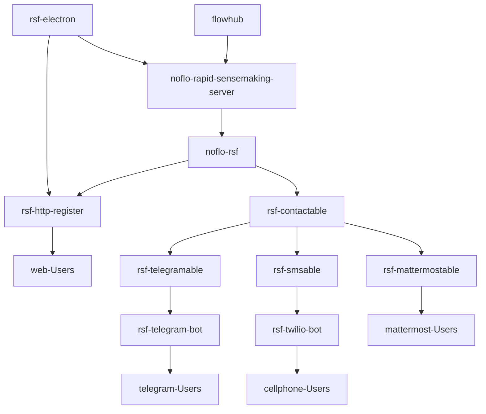

# setup-guide

This is [how Robert set up a server from scratch on digital ocean](/r9fxAcWBRuihzE6xSp38xQ)

## Services

* The Registration page service
    * https://github.com/rapid-sensemaking-framework/rsf-http-register
* The key noflo runtime environment
    * https://github.com/rapid-sensemaking-framework/noflo-rapid-sensemaking-server
* The telegram bot service:
    * https://github.com/rapid-sensemaking-framework/rsf-telegram-bot
* The twilio/texting bot service:
    * https://github.com/rapid-sensemaking-framework/rsf-twilio-bot

## Steps

a first step would be to `git clone …` those 4 repos
```bash
mkdir services
cd services
git clone https://github.com/rapid-sensemaking-framework/rsf-http-register.git
git clone https://github.com/rapid-sensemaking-framework/noflo-rapid-sensemaking-server.git
git clone https://github.com/rapid-sensemaking-framework/rsf-telegram-bot.git
git clone https://github.com/rapid-sensemaking-framework/rsf-twilio-bot.git


# install pm2
# will manage our processes
sudo npm install pm2@latest -g

# refer to this doc for use of systemd
# https://www.digitalocean.com/community/tutorials/how-to-set-up-a-node-js-application-for-production-on-ubuntu-18-04

# install the dependencies
cd rsf-http-register
npm install
# set up the environment variables
# add PORT=3000 to a new .env file
pm2 start --name rsf-http-register npm -- start
pm2 save
cd ..

# noflo-rapid-sensemaking-server
cd noflo-rapid-sensemaking-server
npm install

# TODO this script should be added to the repo
# new script
touch start
# make script executable
chmod a+x start
# modify env variables in `start`
nano start, or vi start
# add to process manager
# startscript will run `start`
# PORT = 3001
# set up TLS
# https://github.com/noflo/noflo-nodejs#securing-the-runtime-connection
pm2 start --name noflo-server npm -- run startscript
pm2 save
cd ..

# rsf-telegram-bot

# install mongodb dependency
sudo apt update
sudo apt install mongodb
sudo systemctl status mongodb
# log in to mongo shell
mongo
> use telegram # create db
> exit

cd rsf-telegram-bot
npm install

# create .env
touch .env
nano .env, or vim .env

# set the environment variables described here
# https://github.com/rapid-sensemaking-framework/rsf-telegram-bot/blob/master/README.md#environment-variables
# including PORT = 3002
pm2 start --name rsf-telegram-bot npm -- start
pm2 save
cd ..

# rsf-twilio-bot
cd rsf-twilio-bot
npm install
# create .env
touch .env
nano .env, or vim .env

# set the environment variables described here
# https://github.com/rapid-sensemaking-framework/rsf-twilio-bot/blob/master/README.md#environment-variables
# including PORT = 3003
pm2 start --name rsf-twilio-bot npm -- start
pm2 save


# opening up the ports
ufw allow 3000
ufw allow 3001
ufw allow 3002
ufw allow 3003
```

into a folder on the server

The general pattern for these things is this…
they reference a PORT environment variable that will need to be set to the correct values of the open ports

they have an `npm start` command which can be run from the root of each folder which boots the service

some of them also expect other environment variables to be set, which I will help with

some are already documented in the repos, some aren’t, so it will be a chance for me to improve the documentation as well.

> With Digital Ocean:
> https://www.digitalocean.com/community/tutorials/how-to-set-up-a-firewall-with-ufw-on-ubuntu-18-04




